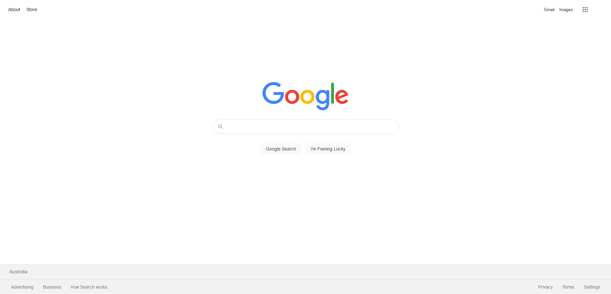
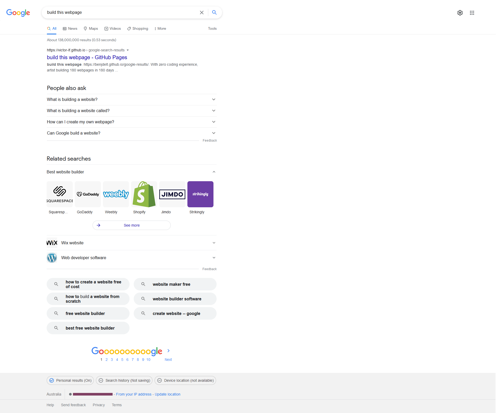

# The Odin Project - Foundations Project: Google Homepage

https://www.theodinproject.com/courses/foundations/lessons/html-css

The task was to re-create the style and format of the Google homepage. Optionally, we were given the task to re-create the results page for a search query - "build this webpage" as a slightly more difficult variation of the same project. 

## Google Homepage - the page to replicate

https://www.google.com/

## Difficult (Optional) - replicate a page with search results 

https://www.google.com/search?q=build+this+webpage
